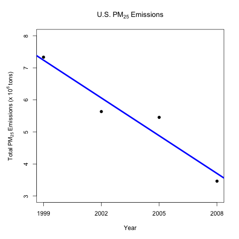
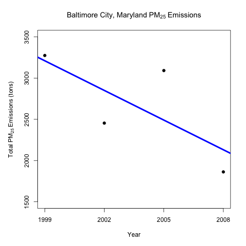
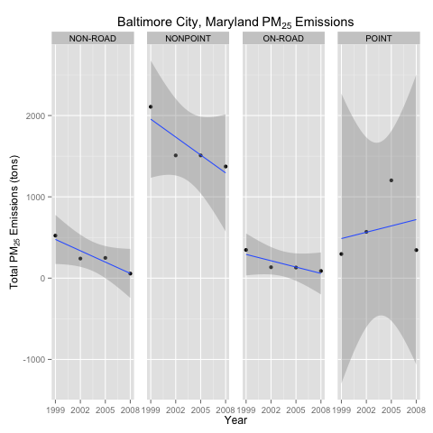
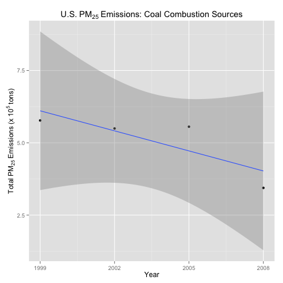
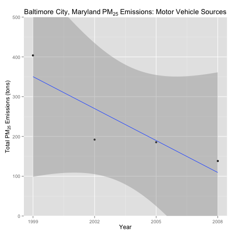
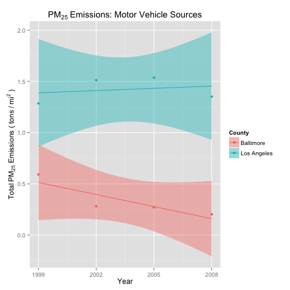

# Exploratory Data Analysis - Project 2
This project focused on using plots to answer questions about trends in
emissions data collected in the United States every three years since
1999.

The original data is for the fine particulate matter PM2.5 polutant,
and was derived from the National Emissions Inventory (NEI) database. 
Refer to the EPA National Emissions Inventory web site for details.

For this project, six questions had to be answered using plots.

1. Have total emissions from PM2.5 decreased in the United States from 
1999 to 2008? Using the base plotting system, make a plot showing the 
total PM2.5 emission from all sources for each of the years 1999, 2002, 
2005, and 2008.

This plot shows that the total emissions of PM2.5 in the U.S. has been
decreasing during the period from 1999 to 2008. The points are the
actual data and the blue line is the linear regression model that fits
the points. To simplify the y-axis labeling the data is plotted in units
of 10^6 tons.

2. Have total emissions from PM2.5 decreased in the Baltimore City, 
Maryland (fips == "24510") from 1999 to 2008? Use the base plotting 
system to make a plot answering this question.

This plot shows that the total emissions of PM2.5 in Baltimore City 
county has been decreasing during the period from 1999 to 2008. The
points are the actual data and the blue line is the linear regression
model that fits the points. Note that there is more variation in the
data for Baltimore City than was evident in the data for the entire U.S.

3. Of the four types of sources indicated by the type (point, nonpoint, 
onroad, nonroad) variable, which of these four sources have seen 
decreases in emissions from 1999–2008 for Baltimore City? Which have 
seen increases in emissions from 1999–2008? Use the ggplot2 plotting 
system to make a plot answer this question.

This plot shows that the total emissions of PM2.5 in Baltimore City
from source types "on-road", "non-road", and "nonpoint" has been 
decreasing during the period from 1999 to 2008, while the emissions 
from source type "point" has been increasing during that time period.
However, the "point" data is more erratic than that from the other 
sources, as can be seen from the much larger area of the shaded 
confidence bands. Hence it suggests an increasing trend, but requires 
additional data points to confirm.

4. Across the United States, how have emissions from coal 
combustion-related sources changed from 1999–2008?

This plot shows that the total emissions from coal combustion sources
in the U.S. has been decreasing during the period from 1999 to 2008. 

5. How have emissions from motor vehicle sources changed from 1999–2008
in Baltimore City?

This plot shows that the total emissions from motor vehicle sources
in Baltimore City has been decreasing during the period from 1999 to 
2008. 

6. Compare emissions from motor vehicle sources in Baltimore City with 
emissions from motor vehicle sources in Los Angeles County, California 
(fips == "06037"). Which city has seen greater changes over time in 
motor vehicle emissions?

To compare the emissions from motor vehicles in these two counties of 
considerably different size, the total emissions were normalized by the 
area of each county in square miles. The two sets of data were plotted 
on the same graph for convenient comparison. Even with the normalization
by area, the motor vehicle emissions in LA are consistenly greater than 
the motor vehicle emissions in Baltimore City. The data also suggests
that the LA emissions are increasing over the 1999-2008 time period,
while the Baltimore City emissions have been more convincingly
decreasing during that time period.